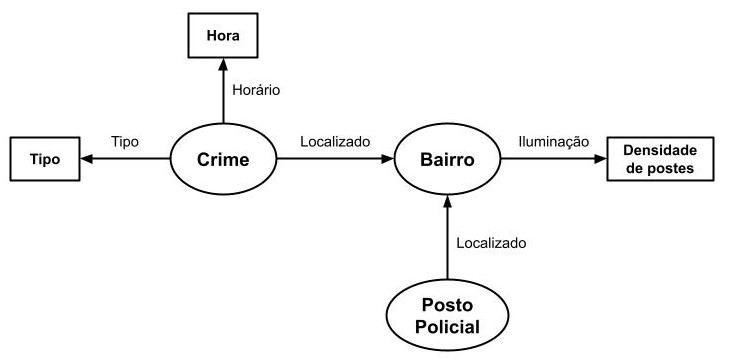

# Lab09 - Grafo de Conhecimento

Estrutura de pastas:

~~~
├── README.md  <- arquivo apresentando a tarefa
│
└── images     <- arquivos de imagem usados na tarefa
~~~

# Aluno
* 231551: Antonio Gabriel da Silva Fernandes

## Exemplo de Grafo de Conhecimento - para publicar
O grafo de conhecimento que pode ser gerado a partir do meu trabalho está exemplificado na figura a seguir:

As triplas recurso-propriedade-valor são da seguinte forma:
| Recurso                 | Propriedade | Valor            |
|-------------------------|-------------|------------------|
| Crime(ID = 134)         | Horário     | 13:44            |
| Crime(ID = 134)         | Tipo        | Furto de celular |
| Crime(ID = 134)         | Localizado  | Butantã          |
| Posto Policial(ID = 73) | Localizado  | Morumbi          |
| Bairro(Morumbi)         | Iluminação  | 145 postes/km^2  |

## Perguntas de Pesquisa ou Queries

* Qual é a relação entre a métrica de iluminação e a quantidade de crimes ocorridos à noite em um certo bairro?
* Qual é a relação entre a quantidade de postos policiais e a quantidade de crimes ocorridos em um certo bairro?
* Quais crimes são mais comuns em quais bairros?